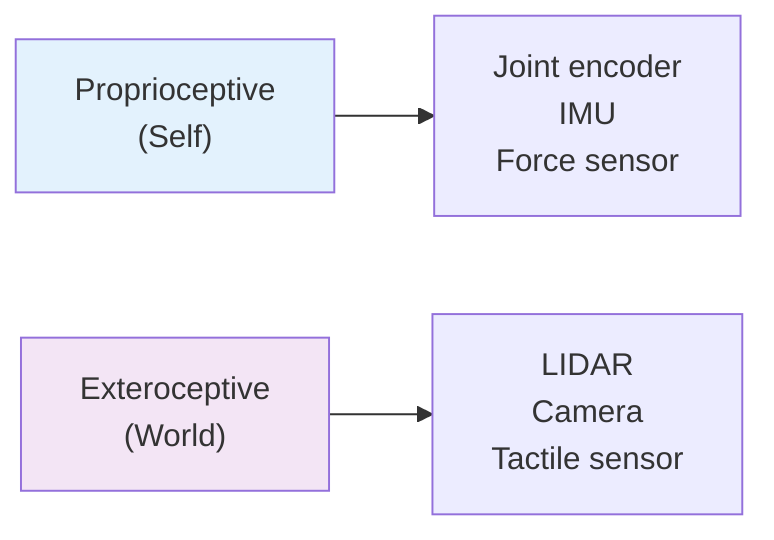
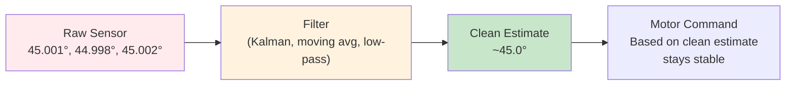

# How Robots See (Sensors)

A robot's "view" of the world comes through sensors—devices that measure physical properties and convert them into digital signals your code can process. But unlike human vision, which feels instantaneous, robot sensors have limitations: they measure one property at a time, their readings contain noise, and they take time to produce usable data.

This lesson explores the sensor types robots rely on, how their data flows through a system, and why filtering that data is essential.

---

## Sensors: What They Measure

Robots use two broad categories of sensors:

**Proprioceptive Sensors** (self-awareness)
- **What they measure**: The robot's own state — position, speed, orientation, forces
- **Examples**: Joint encoders (joint angles), IMU (acceleration + rotation), force/torque sensors
- **Use case**: "Where am I? Am I moving? Am I straining?"

**Exteroceptive Sensors** (world awareness)
- **What they measure**: The environment around the robot — objects, obstacles, terrain
- **Examples**: LIDAR (distance in all directions), cameras (RGB images), tactile sensors (touch)
- **Use case**: "What's around me? Is there an obstacle? What can I grab?"

Here's how they differ:



---

## The Real Problem: Sensor Noise

Raw sensor data is messy. An IMU measuring orientation might read:
```
[Yaw: 45.001°, 44.998°, 45.002°, 44.999°, 45.003°]
```

The true angle is around 45°, but each reading jiggles slightly. This **noise** comes from:
- Electronic interference in sensor circuits
- Tiny vibrations in the robot's body
- Environmental factors (temperature, magnetic fields)

If you use raw sensor data directly in control code, the noise gets amplified:

```
Motor command based on noisy sensor reading → Motor vibrates
Motor vibration causes new sensor noise → Worse vibration
```

This feedback loop is bad. The solution: **filtering**.

### Sensor Data Pipeline

A typical sensor reading goes through three stages:



**What filtering does**: It combines multiple noisy readings to estimate the true value. A **moving average** filter, for example, averages the last N readings to smooth out jitter.

---

## Sensor Latency: The Timing Problem

Sensor readings take time. An example timeline:
- IMU reads acceleration: **1 ms**
- Digital conversion: **2 ms**
- Network transmission (if using cloud): **10-50 ms**
- Your code processes the data: **5 ms**
- Total latency: **18-58 ms**

For a humanoid arm moving at 60°/second, 50 ms of latency means the arm moves 3° between when you sensed its position and when you act on that information. This creates a **control delay** that can make systems unstable.

**Key insight**: You must account for latency in your control design. Faster sensors matter for fast-moving systems.

---

## The Sensor Matching Challenge

Different robot tasks need different sensors:

| Task | Sensor | Why |
|------|--------|-----|
| Navigation (know where you are) | IMU + encoders | Self-location + distance traveled |
| Obstacle avoidance (don't crash) | LIDAR or camera | World-awareness at distance |
| Grasping (grab object) | Force/torque sensor + camera | Touch feedback + visual guidance |
| Legged walking (balance) | IMU + encoders | Orientation + leg position |

A robot doesn't need all sensors at once. A wheeled robot navigating indoors might use:
- Encoders (odometry)
- IMU (drift correction)
- LIDAR (obstacle detection)

But it might skip:
- Force/torque sensors (not manipulating objects)
- Thermal cameras (not needed for navigation)

---

## Interactive Demo: Noisy Sensor → Filtered Estimate

Below is a conceptual visualization of how a filter cleans noisy data. This represents what happens inside a robot:

```
Raw sensor readings (noisy):        Filtered output (clean):
    45.01  ──────                       45.0
    44.99    ───────                    45.0
    45.02      ──────                   45.0
    44.98    ─────                      45.0
```

**The filter's job**: Keep the important signal (the ~45° angle), remove the jitter.

### Why This Matters

In practice:
- **Unfiltered**: Motor oscillates trying to hit a constantly-jittering target
- **Filtered**: Motor moves smoothly to the target

For a humanoid robot picking up a cup, filtering sensor data means the gripper applies steady pressure instead of squeezing then releasing randomly.

---

## Sensor Matching Quiz

Match each sensor to its primary use:

**Sensors**: IMU, LIDAR, Joint Encoder, Camera, Force/Torque Sensor

1. **"Measure the angle of my elbow"** → ?
2. **"Detect that door is 2 meters away"** → ?
3. **"Tell if I'm tilted or falling over"** → ?
4. **"Know how hard I'm gripping"** → ?
5. **"Recognize a person's face"** → ?

<details>
<summary>Answers</summary>

1. Joint Encoder (proprioceptive)
2. LIDAR (exteroceptive)
3. IMU (proprioceptive)
4. Force/Torque Sensor (proprioceptive)
5. Camera (exteroceptive)

</details>

---

## Reflect

Take a moment to think about these questions:

- **In your own body**: When you close your eyes and touch your nose, what sensors are you using? (Hint: not vision.)
- **Noise in real systems**: A humanoid robot's force sensor reads finger pressure. Why would noisy readings be especially bad for delicate grasping?
- **Latency impact**: If sensor latency is 100 ms and your robot arm moves at 1 meter/second, how far does the arm move during that delay?

These reflections connect sensor concepts to real robotic challenges you'll encounter when building systems in the coming chapters.
