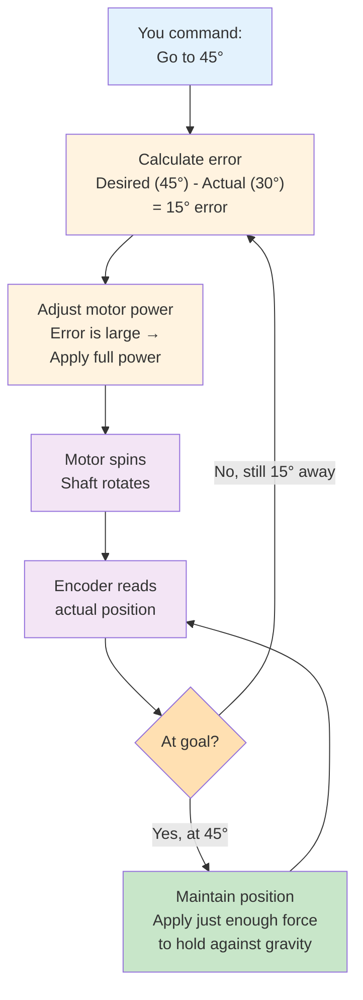
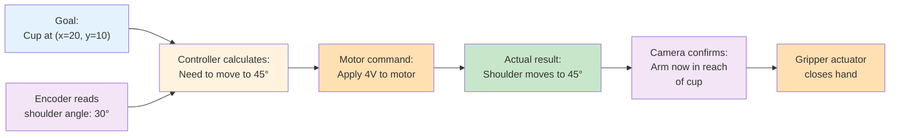

# How Robots Move (Actuators)

Sensors tell a robot what's happening. **Actuators** are how it responds—motors, pumps, electromagnets, any device that converts electrical signals into physical motion. Understanding actuators means understanding what your code can actually make a robot do (and what it can't).

This lesson explores the types of motors robots use, how feedback control keeps them on track, and why motors have limits.

---

## Actuators: Motors and Movement

The most common robot actuators are **electric motors**. They come in several types, each with different properties:

| Motor Type | Characteristics | Use Case |
|-----------|-----------------|----------|
| **Servo Motor** | Can reach specific angles, holds position, torque-limited | Joints in humanoid arms/legs |
| **Stepper Motor** | Steps through discrete positions, no feedback | Precise positioning (3D printers) |
| **Brushless DC Motor** | Fast, efficient, no position feedback needed | Wheels, drones, fast movements |

For a humanoid robot, **servo motors** are most important. A servo motor in a robot arm might look like this:

```
┌──────────────────────────────────────┐
│  Servo Motor Spec Sheet              │
│  ─────────────────────────────────── │
│  Max Torque: 5 Nm                    │
│  Speed: 0.15 seconds per 60° rotation│
│  Gear Ratio: 50:1                    │
│  Position Range: ±170°               │
│  Feedback: Integrated encoder        │
└──────────────────────────────────────┘
```

**What this means in practice:**
- You can command the motor to rotate to angle 45°
- It will get there in ~75 ms (0.15 sec ÷ 360° × 180°)
- It can push with up to 5 Nm of force (enough to lift ~500g at a 1cm lever arm)
- It won't rotate beyond ±170° no matter how hard you try (mechanical stop)

---

## The Control Loop: Command → Feedback → Correction

A servo motor doesn't just spin freely. It has **position feedback** (an encoder that measures the current angle) and **control logic** that compares your desired angle to the actual angle and adjusts the motor power accordingly.

Here's how it works:



**Why this matters**: The servo corrects itself continuously. If you push the arm and it moves off position, the feedback loop automatically pushes back.

---

## Motor Limits: You Can't Exceed Physics

Every motor has hard limits:

**Position Limits (Mechanical Stops)**
- A shoulder joint can't rotate more than ±170° (the joint physically hits a stop)
- Commanding 180° still results in 170° (you're asking for the impossible)
- This prevents damage to the robot

**Torque Limits (Maximum Force)**
- A motor with 5 Nm max torque can lift 5 kg at a 10 cm lever arm, but only 2.5 kg at a 20 cm lever arm
- Try to exceed the limit and the motor stalls (draws excessive current, gets hot)

**Speed Limits (Bandwidth)**
- A motor specified as 0.15 sec/60° can move at max 400°/second
- Asking it to move 500°/second won't work (you'll get 400°/second at best)

**Thermal Limits (Heat)**
- Sustained high torque generates heat
- Running a motor at max power for minutes causes overheating
- Brief peak loads (reaching for something) are fine; sustained loads (holding 50 kg all day) are not

---

## Motor Selection Challenge

Imagine designing a humanoid hand. You need to choose servo motors for the **finger joints** (small, precise) versus the **shoulder joint** (large, powerful).

**Finger Joint Requirements**:
- Range: ±90° (knuckle bend)
- Speed: 0.3 seconds to curl/uncurl
- Torque: 0.5 Nm (light grasping, not crushing)

**Shoulder Joint Requirements**:
- Range: ±170° (arm overhead range)
- Speed: 0.5 seconds to move side-to-side
- Torque: 20 Nm (lifting arm weight + payload)

A single motor can't do both. The finger motor is small and fast but weak; the shoulder motor is slow and powerful. **Motor selection is a critical design decision.**

---

## Feedback Loops: Why They're Essential

Consider what happens without feedback:

```
WITHOUT FEEDBACK (open loop):
You: "Spin to 45°"
Motor: Spins at full power for 500ms
Motor: [has no idea where it actually is]
Result: Maybe 45°, maybe 50°, nobody knows
```

```
WITH FEEDBACK (closed loop):
You: "Go to 45°"
Motor: Spins, checks position every 10ms
Motor: "At 30°, need 15° more"
Motor: [adjusts power down as approaching target]
Motor: "At 45°, done"
Result: Consistently 45° (±1°)
```

**Feedback loops give you reliability.** They compensate for:
- Motor aging (old motors move slower)
- Temperature changes (hot motors behave differently)
- Load variations (sometimes you're holding something heavy, sometimes not)

---

## The Full System: Sensor + Actuator + Controller

Imagine a robot arm reaching for a cup:



Each component is essential:
- **Sensor** (encoder): Tells you what actually happened
- **Controller** (your code): Decides what to do based on goal vs reality
- **Actuator** (motor): Does the physical work

This **sense-think-act** loop happens dozens of times per second in a real robot.

---

## Interactive Motor Spec Calculator

Here's a practical exercise. You're designing a robot that needs to:
- Lift its own arm (2 kg) overhead in 1 second
- Arm length from shoulder to hand: 60 cm

**Calculate required torque:**
```
Torque = Force × Lever Arm
Force = mass × gravity = 2 kg × 10 m/s² = 20 N
Lever Arm ≈ 60 cm = 0.6 m
Torque needed = 20 N × 0.6 m = 12 Nm
```

**Motor selection:**
- ✅ A 20 Nm servo is appropriate (safety margin)
- ❌ A 5 Nm servo is too weak (stalls when lifting)
- ❌ A 50 Nm servo wastes power and is heavier

You can apply this logic to every joint: estimate the load, calculate required torque, choose an appropriate motor.

---

## Reflect

Consider these scenarios:

- **Heavy Load**: You command your robot to lift a 10 kg object, but the motor can only handle 5 Nm. What happens? How would you know it failed?
- **Feedback Failure**: Imagine the encoder breaks and sends wrong position data. How would the motor behave?
- **Speed vs Torque**: Why can't a motor be "fast and strong" at the same time? (Hint: Power = Force × Speed, energy is limited.)

These reflections prepare you for the next lesson, where we'll see how multiple motors coordinating through **middleware** turns individual actuators into a coherent robot system.
